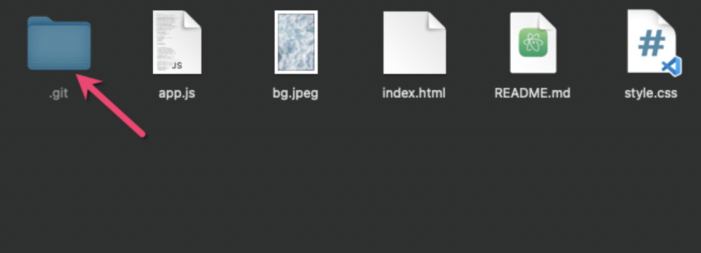
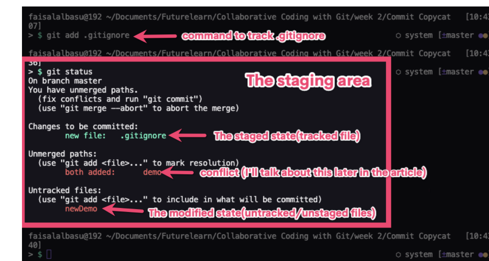
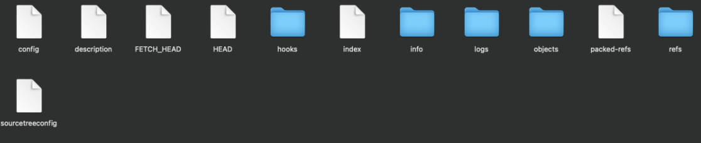
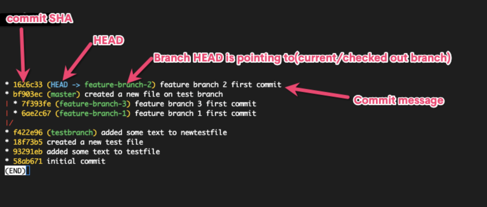
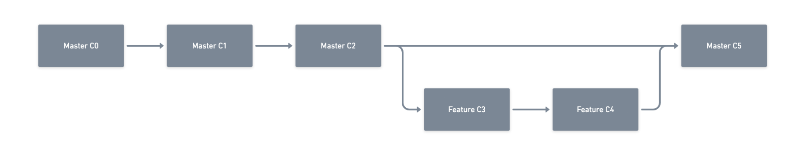
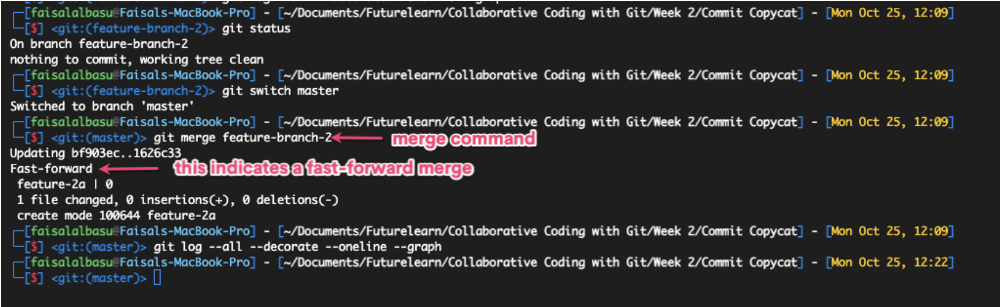
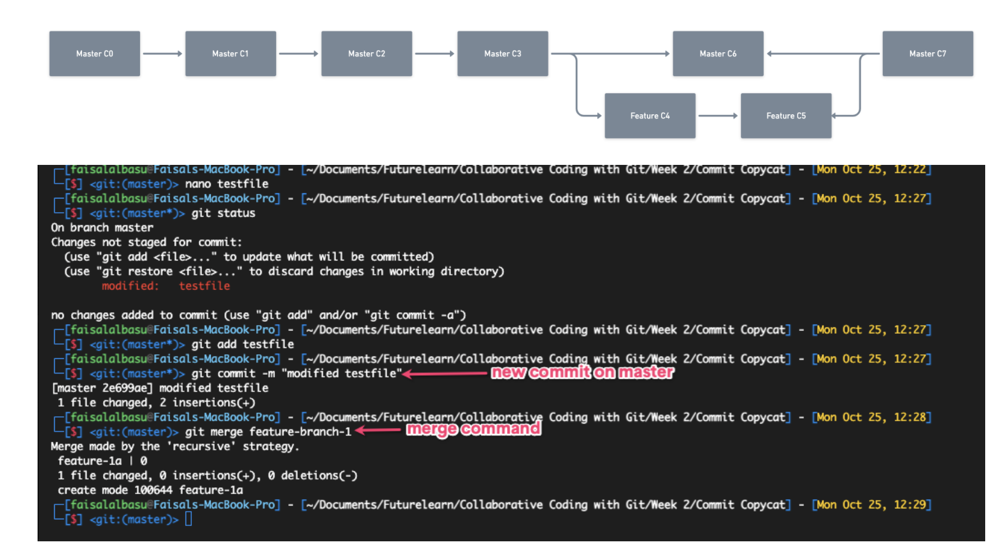
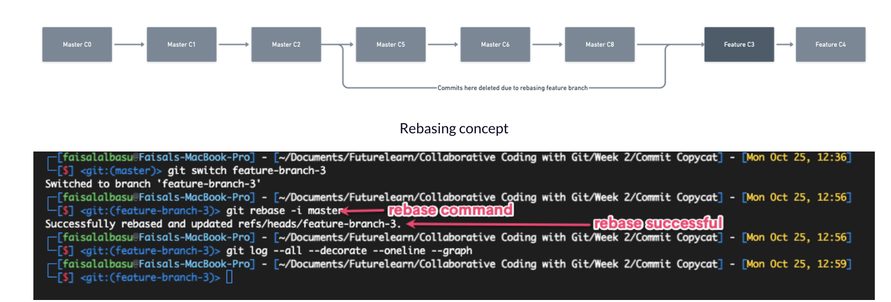

> Som udvikler bruger man en form for **version control**, hvor den mest populær
  er Git.

Popularitet er stor for at bruge Git, men mange få ved hvordan det ser ud
i terminalen og uden IDE og GUI.

Nogle gange vil disse værktøjer komme til kort og en hjælp til at komme videre
i ens process er ved at forstå hvordang Git egentlig virker. 

I denne post vil jeg komme omkring hvordan Git egentlig virker og hvad
der er værd at vide.

## Hvad er Git og hvordan virker det?

Git bliver betegnet som et *distribution version system*, der hjælper
udvikler, analytiker, ML inginør at holde styr på ændringer i deres projekter.


Når man laver et nyt projekt med: `git init`, laver det en gemt folder: `.git`
som indeholder filer og folder. Disse indeholder det Git bruger til at lave referencer til
bestemte directory.



Efter at have startet et nyt repo, vil Git tracke alle filder og folder
indeni diretion undtaget dem vi specifik har bedt om ikke at holde øje med i
`.gitignore`. De filer og folder man tilføjer vil ikke blive tracket i projektet.
After initializing the repository, Git starts tracking all the files and folders inside that directory except those you explicitly tell it to not track in the .gitignore file. The .gitignore file is a hidden that lets you list all the files and folders you don't want Git to track. These files and folders would never be referenced by Git in your project.

Når man arbejder med Git, så vil ens filer bliver gemt i tre forskellige stadier:

* `The Modified State` - Hvor man kan tilføje, fjerne elle rændre en fil. Her 
ved Git at der er sket en ændring i filen, men det er ikke blevet noteret.
* `The Staged State` - Her informerer man Git om ændirngen. 
* `The Committed State` - Git har gemt ens ændring og man kan checke det med
  `git status`.



Når man *commit* kode, så vil Git tage et snapshot af versionen, som man kan 
referer til senere. 

Derfor kaldes Git ofte for en *Reference Database* for projekter. Databasen er bygget
op omkring tre typer af objekter:

* Commits som indeholder metadata for hver commit, såsom beskeder og koder.
* Træ ændring, der indeholder filnavn, fil indhold og nogle gange andre træer.
* En blob, hvor man tænker det som en repræsentation af det faktiske data. 

#### Indhold i Git folder




## Sådan holder Git styr på dine filer

Git kan håndere at filer bevæger sig rundt og ændrer lokation, da den laver en
såkaldt **Secure Hash Algorithm (SHA)**, som er en serier af cryptographic hash
funktioner og tilskriver dem til hver commit. På den måde kan man letter 
identificerer duplikater og referer dem til den orginale fil og derved
spare på storage.

Ved brugen af SHA, kan vi referer alt i Git og gå tilbage i commits.



Hver commit udover det initiale commit har en forældre commit, og når man
starter et projekt vil ens **HEAD** pege mod den seneste commit på master branch.

Det holdes ved lige ved brug af SHA tallene tilkoblet ens commit. Når man lavet en ny
branch laves der en kopi af alle filer. Når vi skifter branch vil HEAD ændring til den
seneste commit til den tilhørende branch.

Selttede branches har ingen HEAD. For at få adgang skal vi have den unikke hash.

Når vi arbejder med Git laver vi nye branches for at indikere vi arbejder på features eller bug fixes. 
For at lave nye branhce skal man bruge denne kommando:

```
git branch [branch name]
```
## Hvad er Git merge og hvordan virker det?

Hvis man har en ny fed model eller feature til ens porjekt som man vil arbejde på og ikke påvirke hvad
der er i produktion laver man ofte en ny branch for senere at merge med master.

Der er forskellige måder at merge branch sammen, som jeg vil gennemgå nu. De kaldes: *the fast-forward merge*, *three-way merge*, og *rebasing*.

Fast-forward merge, er den hurtigst måde at merge brancher sammen og kræver ofte ikke nogen løsning af konflikter. Det skyldes at vi flytter HEAD fra den nuværende commit af master branch indtil den seneste commit for den brnach vi merge på. Man kan sige 
at vi flytter et projekt frem i tid.





Three-way merge, kræver mere fordi vi skal håndtere tre commits. Det sker når den branch vi prøver at merge til er foran den
branch vi forsøger at merge. F.eks. så laver Du en branch for at fixe en bug, men  på samme tid har en kollega lavet et commit på 
master branch og tilføjet et commit.

Git kan ikke elegant integrerer Din branch med master fordi master er foran:



Rabasing er en måde at overføre en hel feature branch ind i master. En ulempe ved rebasing er man mister ens projekt historie. Når vi merge kan vi se på historien for branch, men ved rebase går det tabt. 

